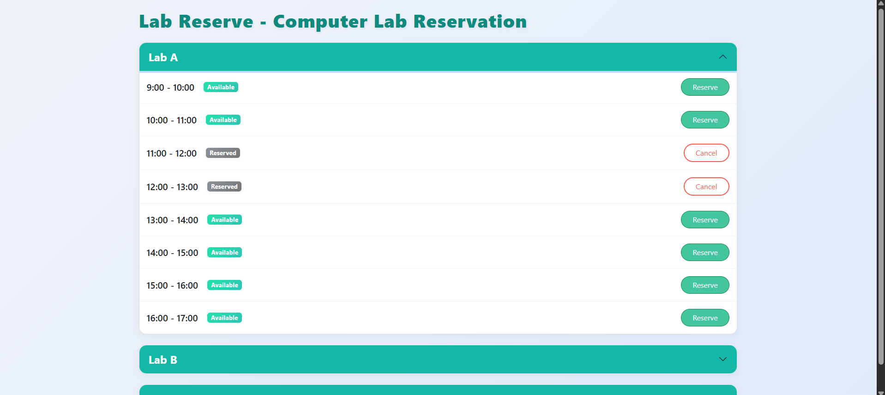
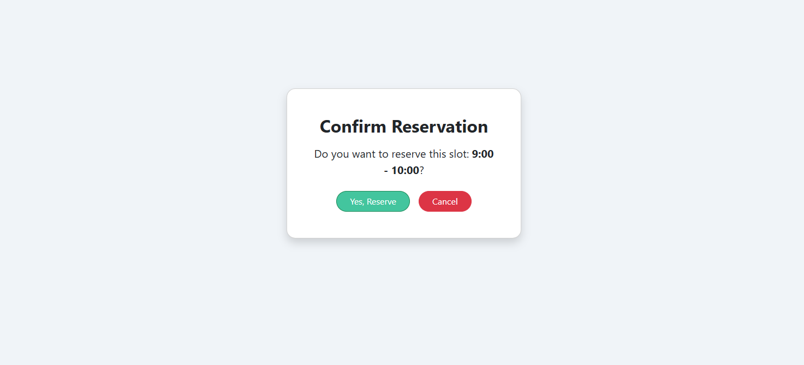
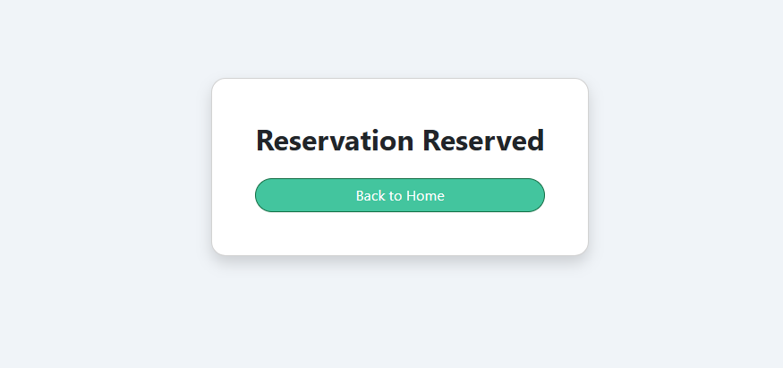
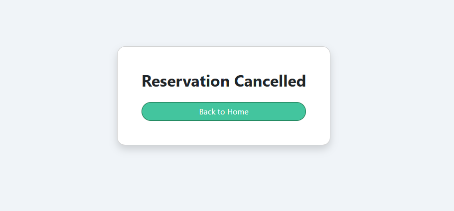

# LabReserve

A simple computer lab reservation app built with Flask + SQLite.

## Features

- View available labs and hourly time slots.
- Instantly see each slot's status as Available or Reserved.
- Reserve or cancel a slot with a single click (no login needed).
- Modern, mobile-friendly design using Bootstrap and custom CSS.
- Get clear confirmation messages after reserving or cancelling.
- Prevents double booking for reserved slots.
- Collapse and expand each lab section for easy navigation.


## How to Run

1. **Clone or download the project folder.**
    - Unzip if needed and open the folder in your terminal.
    - Open bash terminal in VS Code.

2. **Set up a Python virtual environment:**
    ```bash
    python -m venv venv
    ```

3. **Activate the virtual environment:**
    ```bash
    source venv/Scripts/activate
    ```
    
4. **Install the dependencies:**
    ```bash
    pip install -r requirements.txt
    ```

5. **Start the app:**
    ```bash
    python app.py
    ```

6. **Open the app in your browser:**
    - Go to [http://127.0.0.1:5000/](http://127.0.0.1:5000/)


## Screenshots / Demo

### Main Screen (Labs List & Reservation)


### Reservation Confirmation


### Reservation Reserved


### Reservation Cancelled


## Reflection Questions

**1. What part of the project was most challenging?**  
The most challenging part was setting up Python on my laptop, since I had no prior experience with Python. I ran into several issues with the installation, PATH configuration, and virtual environments. However, after some troubleshooting, I managed to get it working and learned a lot about Python setup in the process.

**2. What would you add or improve if you had more time?**  
If I had more time, I would like to add features such as authentication or security (so only authorized users can reserve/cancel), filtering/search for labs and time slots, options to update or edit reservations, and further update the design for a more user-friendly experience. I would also add email notifications for confirmed or canceled reservations.

